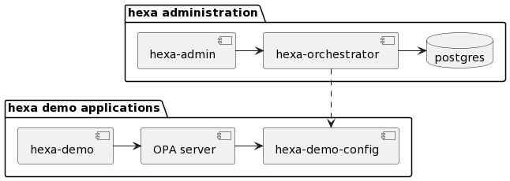

# Hexa Policy Orchestrator

[](https://github.com/hexa-org/policy-orchestrator/actions)
[](https://goreportcard.com/report/hexa-org/policy-orchestrator)
[](https://codecov.io/gh/hexa-org/policy-orchestrator)
[](https://github.com/hexa-org/policy-orchestrator/actions/workflows/codeql-analysis.yml)

Hexa is the open-source, standards-based policy orchestration software for multi-cloud and hybrid businesses.

The Hexa project contains three applications.
* Policy Administrator web application
* Policy Orchestrator server with IDQL translations
* Demo application

Hexa Policy Orchestration (Hexa) and Identity Query Language (IDQL) were purpose-built to solve the proliferation of
policy orchestration problems caused by today’s hybrid cloud and multi-cloud world. Together, Hexa and IDQL enable you
to manage all of your policies consistently across clouds and vendors so you can unify access policy management.

## Getting Started

Clone or download the codebase from GitHub to your local machine and install the following prerequisites.

* [Go 1.17](https://go.dev)
* [Pack](https://buildpacks.io)
* [Docker Desktop](https://www.docker.com/products/docker-desktop)

```bash
cd /home/user/workspace/
git clone git@github.com:hexa-org/policy-orchestrator.git
```
### Build

Build a Hexa image with Pack. The newly created image will contain the policy
administrator web application, policy orchestrator server, and demo application.

```bash
pack build hexa --builder heroku/buildpacks:20
```

We'll be using postgresql and need to execute the below shell scripts from docker-compose.

```bash
chmod 775 ./databases/docker_support/initdb.d/create-databases.sh
chmod 775 ./databases/docker_support/migrate-databases.sh
```

### Run

Run all the applications with docker compose.

```bash
docker-compose up
```

The docker-compose spins up a few applications. A few of them are described below.

**hexa-admin** runs on [localhost:8884](http://localhost:8884/). This is the application used to manage and
configure IDQL policy across the various integrations.

**hexa-orchestrator** runs on [localhost:8884](http://localhost:8885/health). This is the policy orchestrator which
communicates with the various providers to convert the IDQL policy to the respective types.

**hexa-demo** runs on [localhost:8886](http://localhost:8886/). This is the demo application against which
we can enforce policy. It reads its policy from the OPA server.

**OPA server** runs on [localhost:8887](http://localhost:8887/). This is the OPA server from which the
hexa-demo application reads its policies from. As an additional layer of
indirection, it gets the policies from a bundle server.

**hexa-demo-config** runs on [localhost:8889](http://localhost:8889/health). This is bundle HTTP server from which the
OPA server can download the bundles of policy and data from.
See [OPA bundles](https://www.openpolicyagent.org/docs/latest/management-bundles/) for more info.

### Workflow

In the hexa-admin application, we can specify an Open Policy Agent integration
configuration file which defines the bundle HTTP server where the actual OPA rego
policy lives.

Once configured, IDQL policy for the hexa-demo application can be defined on
the Applications page. The hexa-admin communicates the changes to the
hexa-orchestrator which makes the translation to OPA rego and updates the
hexa-demo-config bundle server.

The OPA server periodically reads config from the _hexa-demo-config_ bundle
server and updates access to the hexa-demo application.



### Cleanup

Cleaning up. Remove all docker containers and volumes.

```bash
docker rm -f $(docker ps -a -q)
docker volume rm -f $(docker volume ls -q)
docker system prune -a -f
```

Remove the local postgres database files.

```bash
rm -rf .postgres
```

## Cloud Native Computing Foundation

Hexa uses the below Cloud Native Computing Foundation ([CNCF](https://www.cncf.io/)) projects
* [Contour](https://projectcontour.io/)
* [Harbor](https://goharbor.io/)
* [Helm](https://helm.sh/)
* [Kubernetes](https://kubernetes.io/)
* [Open Policy Agent](https://www.openpolicyagent.org/)
* [Pack](https://buildpacks.io/)
* [Prometheus](https://prometheus.io/)


[opa-bundles]: https://www.openpolicyagent.org/docs/latest/management-bundles/