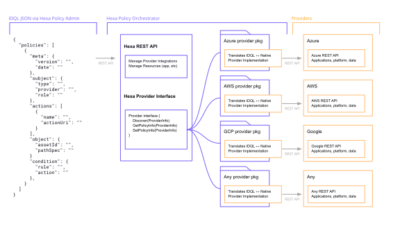
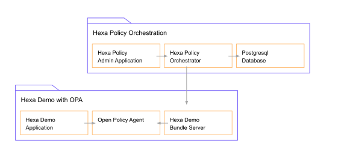

# Hexa Policy Orchestrator

[](https://github.com/hexa-org/policy-orchestrator/actions)
[](https://goreportcard.com/report/hexa-org/policy-orchestrator)
[](https://codecov.io/gh/hexa-org/policy-orchestrator)
[](https://github.com/hexa-org/policy-orchestrator/actions/workflows/codeql-analysis.yml)

Hexa Policy Orchestrator enables you to manage all of your policies consistently across software providers
so that you can unify access policy management. The below diagram describes the current provider architecture -



## Getting Started

The Hexa project contains three applications - 

* Policy Orchestrator with policy translations
* Demo Policy Administrator
* Demo web application

Clone or download the codebase from GitHub to your local machine and install the following prerequisites.

* [Go 1.17](https://go.dev)
* [Pack](https://buildpacks.io)
* [Docker Desktop](https://www.docker.com/products/docker-desktop)

```bash
cd /home/user/workspace/
git clone git@github.com:hexa-org/policy-orchestrator.git
```

### Build the Hexa image

Build a Hexa image with Pack. The newly created image will contain the policy
administrator web application, policy orchestrator server, and demo application.

```bash
pack build hexa --builder heroku/buildpacks:20
```

We'll be using postgresql and need to execute the below shell scripts from docker-compose.

```bash
chmod 775 ./databases/docker_support/initdb.d/create-databases.sh
chmod 775 ./databases/docker_support/migrate-databases.sh
```

### Run the Policy Orchestrator

Run all the applications with docker compose.

```bash
docker-compose up
```

Docker runs the applications described below.

## Application descriptions 

**hexa-orchestrator** runs on [localhost:8885](http://localhost:8885/health). The main application
that manages IDQL policy across various platforms and communicates with the various platform interfaces;
converting IDQL policy to and from the respective platform types.

**hexa-admin** runs on [localhost:8884](http://localhost:8884/). An example application
demonstrating the latest interactions with the policy orchestrator.

**hexa-demo** runs on [localhost:8886](http://localhost:8886/). A demo application used to highlight
enforcing both coarse and fine-grained policy. The application integrates with platform
authentication/ authorization proxies, [Google IAP](https://cloud.google.com/iap) for example,
for coarse grained access and the [Open Policy Agent (OPA)](https://www.openpolicyagent.org/)
for fine-grained policy access.

**OPA server** runs on [localhost:8887](http://localhost:8887/). The Open Policy Agent (OPA) server used to 
demonstrate fine-grained policy management. IDQL policy is represented as data and interpreted by
the rego expression language.

**hexa-demo-config** runs on [localhost:8889](http://localhost:8889/health). The bundle HTTP server from which the
OPA server can download the bundles of policy and data from. See [OPA bundles][opa-bundles] for more info.

### Example workflow

Fine-grained policy management with OPA.

Using the hexa-admin application available via docker-compose, upload an OPA integration
configuration file. The file describes the location of the IDQL policy.

```json
{
  "bundle_url":"http://hexa-demo-config:8889/bundles/bundle.tar.gz"
}
```

Once configured, IDQL policy for the hexa-demo application can be modified on
the Applications page. The hexa-admin communicates the changes to the
hexa-orchestrator or **policy management point** which then updates the hexa-demo-config bundle server -
making the updated policy available to the OPA server.

OPA or **policy decision point** periodically reads config from the hexa-demo-config bundle
server and allows or denies access requests based on the IDQL policy.
Decision enforcement is handled within the hexa-demo application or **policy enforcement point**.



## Getting involved

Here are a few links for those interested in contributing to the Hexa project.

* [Contributing](CONTRIBUTING.md)
* [Code of Conduct](CODE_OF_CONDUCT.md)
* [Development](DEVELOPMENT.md)
* [Security](SECURITY.md)

The current demo deployment infrastructure can be found at this [link](infrastructure/README.md).

[opa-bundles]: https://www.openpolicyagent.org/docs/latest/management-bundles/