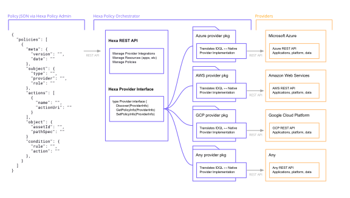
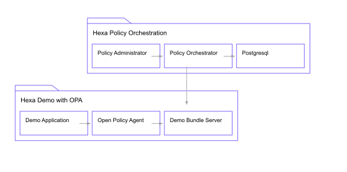

# Table of Contents
- [Hexa Policy Orchestrator](#hexa-policy-orchestrator)
  * [Getting Started](#getting-started)
    + [Build the Hexa image](#build-the-hexa-image)
    + [Run the Policy Orchestrator](#run-the-policy-orchestrator)
  * [Application descriptions](#application-descriptions)
    + [Example workflow](#example-workflow)
  * [Getting involved](#getting-involved)


# Hexa Policy Orchestrator

[](https://github.com/hexa-org/policy-orchestrator/actions)
[](https://goreportcard.com/report/hexa-org/policy-orchestrator)
[](https://codecov.io/gh/hexa-org/policy-orchestrator)
[](https://github.com/hexa-org/policy-orchestrator/actions/workflows/codeql-analysis.yml)

Hexa Policy Orchestrator enables you to manage all of your policies consistently across software providers
so that you can unify access policy management. The below diagram describes the current provider architecture.



## Getting Started

The Hexa project contains three applications

- Policy Orchestrator with policy translations
- Demo Policy Administrator
- Demo web application

To get started with running these, clone or download the codebase from GitHub to your local machine:

```bash
cd $HOME/workspace # or similar
git clone git@github.com:hexa-org/policy-orchestrator.git
```

### Prerequisites

Install the following dependencies.

- [Go 1.18](https://go.dev)
- [Pack](https://buildpacks.io)
- [Docker Desktop](https://www.docker.com/products/docker-desktop)

> NOTE:
>
> These packages, along with a number of supporting software utilities, may be
> installed via `./bin/pkg.d/setup.sh`.
>
> Additionally, once that setup script has been run, the `pkg` bash CLI is made
> available and may be executed from anywhere within the repository. Try
> `pkg --help`, for example.

### Task: Build the Hexa image

Build a Hexa image with `pack`. The newly created image will contain the policy
administrator web application, policy orchestrator server, and demo application.

```bash
pack build hexa --builder heroku/buildpacks:20
```

> NOTE:
>
> Assuming previous execution of the "setup" script above, this task may be run
> from anywhere in the repository as `pkg build`.

### Task: Prepare the Database

The Hexa applications use PostgreSQL. A number of scripts and TLS files need to be installed/executed when running in Docker (see below). So...

```bash
chmod 775 ./databases/docker_support/initdb.d/create-databases.sh
chmod 775 ./databases/docker_support/migrate-databases.sh
chmod 600 ./databases/docker_support/ca-cert.pem
chmod 600 ./databases/docker_support/client-cert.pem
chmod 600 ./databases/docker_support/client-key.pem
```

> NOTE:
>
> Assuming previous execution of the "setup" script above, this task will be
> run as part of `pkg serve`, executable from anywhere in the repository.

### Task: Run the Policy Orchestrator

Run all the applications with Docker Compose.

```bash
docker-compose up
```

> NOTE:
>
> Assuming previous execution of the "setup" script above, this task may be run
> from anywhere in the repository as `pkg build`.

## Application Descriptions

Docker runs the following applications:

- **hexa-orchestrator**

  Runs on [localhost:8885](http://localhost:8885/health). The main application
  that manages IDQL policy across various platforms and communicates with the
  various platform interfaces, converting IDQL policy to and from the respective
  platform types.

- **hexa-admin**

  Runs on [localhost:8884](http://localhost:8884/). An example application
  demonstrating the latest interactions with the policy orchestrator.

- **hexa-demo**

  Runs on [localhost:8886](http://localhost:8886/). A demo application used to
  highlight enforcing of both coarse and fine-grained policy. The application
  integrates with platform authentication/ authorization proxies,
  [Google IAP](https://cloud.google.com/iap) for example, for coarse-grained
  access and the [Open Policy Agent (OPA)](https://www.openpolicyagent.org/)
  for fine-grained policy access.

- **OPA server**

  Runs on [localhost:8887](http://localhost:8887/). The Open Policy Agent (OPA)
  server used to demonstrate fine-grained policy management. IDQL policy is
  represented as data and interpreted by the [Rego](https://www.openpolicyagent.org/docs/latest/policy-language/)
  expression language.

- **hexa-demo-config**

  Runs on [localhost:8889](http://localhost:8889/health). The bundle HTTP
  server from which the OPA server can download the bundles of policy and data
  from. See [OPA bundles][opa-bundles] for more info.

## Example Workflow

Fine-grained policy management with OPA.

Using the **hexa-admin** application available via `docker-compose`, upload an
OPA integration configuration file. The file describes the location of the IDQL
policy. An example integration configuration file may be found in
[deployments/opa-server/example](deployments/opa-server/example).

Once configured, IDQL policy for the **hexa-demo** application can be modified
on the [Applications](http://localhost:8884/applications) page. The
**hexa-admin** communicates the changes to the **hexa-orchestrator**, or
"Policy Management Point (PMP)", which then updates the **hexa-demo-config** bundle
server, making the updated policy available to the OPA server.

OPA, the "Policy Decision Point (PDP)", periodically reads config from the
**hexa-demo-config** bundle server and allows or denies access requests based on
the IDQL policy. Decision enforcement is handled within the **hexa-demo**
application or "Policy Enforcement Point (PEP)".

The Hexa Demo architecture may be visualized as follows:



## Getting involved

Take a look at our [product backlog](https://github.com/orgs/hexa-org/projects/1)
where we maintain a fresh supply of good first issues. In addition to
enhancement requests, feel free to post any bugs you may find.

- [Backlog](https://github.com/orgs/hexa-org/projects/1)

Here are a few additional resources for those interested in contributing to the
Hexa project:

- [Contributing](CONTRIBUTING.md)
- [Code of Conduct](CODE_OF_CONDUCT.md)
- [Development](DEVELOPMENT.md)
- [Security](SECURITY.md)

This [repository](https://github.com/hexa-org/policy-orchestrator) also includes
[documentation](docs/infrastructure/README.md) for the current demo deployment
infrastructure.

[opa-bundles]: https://www.openpolicyagent.org/docs/latest/management-bundles/
